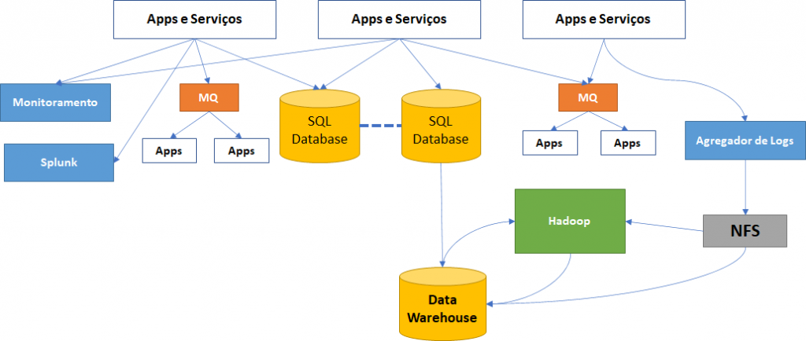
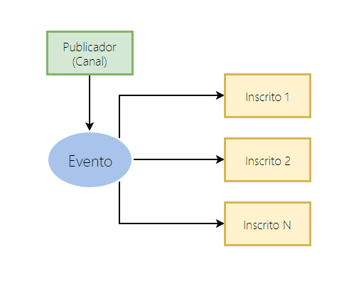
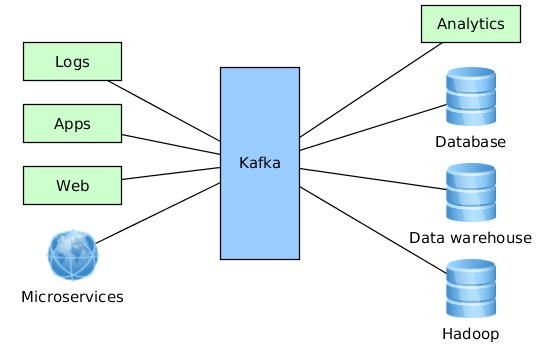
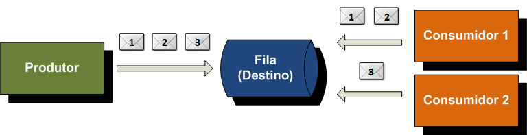
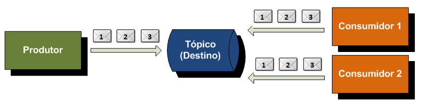
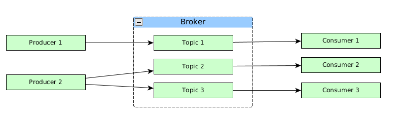
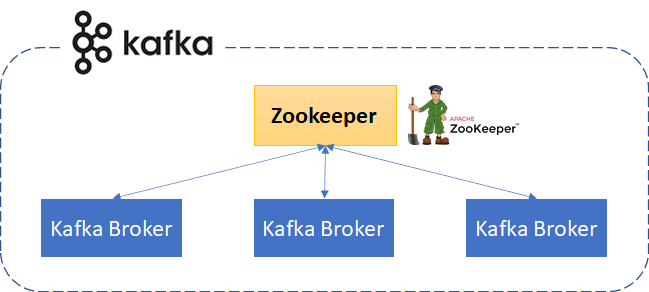

# Introdução 

Atualmente o Kafka é utilizado para realizar transferência de dados entre aplicações.
Como podemos notar, o volume de dados está crescendo a cada dia e, além disso, não podemos correr o
risco de perder dado por algum bug da aplicação, deploy, entre outros.

Imagine a compra de um livro na amazon:
 

* O pagamento é realizado pelo cartão de crédito;
* A operadora precisa se certificar que tenha limite no cartão;
* Se os dados estão corretos;
* Se não é fraude;
* E Mais algumas validações. 

Nesse exemplo podemos ter várias aplicações (micro-services) com as suas regras de negócio isoladas,
recebendo estímulos para processar essas informações e não precisam se preocupar 
com entrega/captura dos dados para processamento.

E a partir dai adentramos no data streaming.

*Exemplo de comunicação de sistema.*

## Data Streaming

Data streaming é um fluxo constante e sem controle de dados, normalmente não se sabe onde
começa e termina o fluxo. Os dados vão sendo processados a medida que chegam no seu consumidor,
praticamente em tempo real.Mas não quer dizer que essa é apenas a sua única caraterística, 
os dados também podem ser processados em batch ou lote com hora e data pré-estabelecidas.

Os dados chegam através de mensagens que são armazenadas, permitindo paralelizar 
o processamento entre aplicações ou apenas processar de forma assíncrona.

Pode-se usar esse forma de processamento em qualquer ramo para agilizar:

* Bancário;
* Imobiliário; 
* Industrial;
* E até mesmo para migração de grandes bases de dados.

## Mas afinal, o que é Kafka?

O Apache Kafka foi um sistema desenvolvido pelo Linkedin para streaming de dados. E atualmente Netflix, 
Spotify, Uber, Twitter e o próprio Linkedin estão utilizando nas suas plataformas para auxiliar no processamento de informaçöes.
 

Originalmente foi criado para ser um sistema baseado em logs e teve até os seguintes nomes:
write-ahead logs, commit logs ou até mesmo transaction logs.
 

Para auxiliar no entendimento dessa prática, explicitamos abaixo o funcionamento das técnicas:

* Write-ahead Logs (WAL), commit logs ou transaction logs se baseiam numa técnica 
  que fornece atomicidade e durabilidade (propriedades do ACID -
Atomicidade, Consistência, Isolamento e Durabilidade) num sistema de banco de dados.
A técnica consiste em gravar todas as informações em logs e depois aplica-los no banco de 
dados. Exemplo de um cenário que essa técnica pode ser extremamente útil: 
  * Se a máquina onde a aplicação de um banco está perde energia ou é desligada no meio de um processo.
Ao religa-la, essa aplicação precisará de informação do processo que estava realizando, 
se foi concluído com sucesso ou continuar de onde parou. 
A aplicação do banco que utliza essa técnica, consultará os logs pra obter essas informações.

*Lembrando que um log é nada menos que uma forma de armazenamento de dado, 
onde toda nova informação é adicionada no final do arquivo. Esse é o princípio do Kafka.*

## Kafka e suas funcionalidades

* Publish/Subscribe — é um pattern que consiste em ter um ou mais publicadores que terá um ou mais
  consumidor/inscrito e as duas pontas trocam mensagens de forma indireta.
  Dentro desse pattern temos uma subdivisão de publicador/canal, evento/publicação e inscrito/assinante.

* Sistema de armazenamento, por padrão as mensagens são armazenadas por 7 dias, mas pode ser alterado
 para armazenar indefinidamente.

* Processamento de stream: processamento imediato de um fluxo de mensagens (data streaming).

 \
*Pattern publish/subscribe* 

O Kafka é um intermediário que trabalha coletando informações e armazenando para os consumidores.

O kafka vem sendo adotado para processos ETL(Extract Transform and Load), de forma a copiar os dados 
de uma banco de dados tradicional (OLTP) para um analítico (OLAP).
* ETL: é um data integration em 3 etapas, que consiste em extração, transformação e carregamento de dados.
Utilizado normalmente para combinar dados de diversas fontes gerando um data warehouse. Para alguns, o futuro 
  do ETL seja utilizar kafka para diminuir a dificuldade desse processo.

# Nomenclatura, conceitos e características  

A mensagem ou evento é composto por:
- Nome do Tópico: fila ao qual mensagem será postada/gravada;
- Partição: subdivisão de um tópico, a partição ajuda no balanceamento de carga, entre outras funções.
- Timestamp: data e hora dos registros para ordenação fifo.
- Chave: utilizada para cenários mais avançados, não abordaremos esses cenários por enquanto;
- Valor: informação que deseja se enviar, normalmente composta por json, xml ou até mesmo uma string.

No kafka, temos as seguintes arquiteturas de mensageiria: 
* Publish-subscribe; 
* Point-to-point.

O modelo point-to-point é baseado em conceito de filas, onde o produtor envia a mensagem para 
uma fila especifica, que a armazena para entregar ao consumidor ou até a mensagem expirar
(Dependendo da configuração de armazenamento da mensagem, a mesma pode ficar eternamente na fila). 
Caso essa fila possua mais de um consumidor apenas um a receberá.

O modelo do publish/subscribe se baseia na troca de mensagens utilizando o modelo de tópicos, onde as mensagens
são enviadas para os consumidores que assinaram o tópico.
Ao contrário do point-to-point esse modelo permite que envie a mesma mensagem para vários
consumidores.

O Apache Kafka trabalha com o publish/subscribe, pois a solução tem baixa latência 
para receber e enviar as mensagens. 

Além do pattern, a arquitetura ainda possui as seguintes características:

- Escalabilidade: o cluster do Kafka permite o redimensionamento para atender a demanda de maneira simples;
- Distribuído: o cluster pode operar com vários nós (brokers) para facilitar o processamento;
- Replicado, particionado e ordenado: as mensagens podem ser replicados na ordem que chegam para 
facilitar processamento, segurança e auxiliar na velocidade de entrega.
- Alta disponibilidade: o cluster tem diversos nós (brokers) e várias cópias tornando-o
sempre disponível caso um nó esteja indisponível.
  
 
# Arquitetura Apache Kafka

Arquitetura do Kafka é composta por producers, consumers e o seu cluster.

O producer é qualquer aplicação que publica uma mensagem no Kafka. O consumer é qualquer aplicação que
consume as mensagens do kafka. Já o cluster é conjunto de nós (brokers kafka) que funcionam 
como única instância de serviço da mensageria.

Um cluster Kafka possui vários brokers. Um broker ou nó é um servidor kafka que recebe as mensagens dos produtores 
e as armazena em disco com uma chave exclusiva de offset.
 

Um broker do Kafka permite que os consumidores busquem a mensagem por tópico, group id, partição e offset. 

Brokers fazem parte de um cluster compartilhando informações entre si direta ou indiretamente,
sendo que um dos brokers atua como controlador(controller).

Para gerenciar os brokers do Kafka temos o Zookeeper que armazena todos os metadados dos cluster,
partições, nomes tópicos e os nós disponíveis, além de manter a sincronização entre os clusters.

Em caso de queda de algum cluster o Zookeeper elege o próximo cluster que irá substituir.

#### Acesso Sequencial ao Disco
*O Kafka trabalha com gravação e leitura sequencial no disco para garantir que não há perda de dados,
caso aconteça algum desligamento acidental da máquina. Esse acesso permite que o Kafka saiba onde 
começa e onde termina cada bloco de mensagens.*

 
# Ferramentas semelhantes

Existe outras ferramentas similares ao Kafka, como :

* ActiveMq;
* RabbitMq.

Sendo que cada uma possui as suas características especificas.

# Hands on

Agora que já apresentamos os principais conceitos do Kafka, vamos por a mão na massa.

Começando pelo nosso docker compose que será responsável por subir o nosso cluster.

Utilizamos as imagens do confluentinc por serem mais estáveis e confiáveis, abaixo apresentamos a configuração básica do zookeeper:

       zookeeper:
        image: confluentinc/cp-zookeeper:5.1.2
        restart: always
        environment:
          ZOOKEEPER_SERVER_ID: 1
          ZOOKEEPER_CLIENT_PORT: "2181"
          ZOOKEEPER_TICK_TIME: "2000"
        ports:
        - "2181:2181"

* ZOOKEEPER_SERVER_ID: necessário apenas para executar no modo de cluster, 
  definindo o ID do servidor. Por exemplo, o id do servidor 1 conteria apenas o texto “1“. 
  O ID deve ser exclusivo dentro do conjunto e deve ter um valor entre 1 e 255.
* ZOOKEEPER_CLIENT_PORT : informa a porta que os clientes do Kafka irão escutar.
* ZOOKEEPER_TICK_TIME : unidade de tempo utilizada pelo zookeeper para validações.

      kafka1:
      image: confluentinc/cp-kafka:5.1.2
      depends_on:
      - zookeeper
      ports:
        - "29092:29092"
      environment:
          KAFKA_ZOOKEEPER_CONNECT: "zookeeper:2181"
          KAFKA_LISTENER_SECURITY_PROTOCOL_MAP: PLAINTEXT:PLAINTEXT,PLAINTEXT_HOST:PLAINTEXT
          KAFKA_INTER_BROKER_LISTENER_NAME: PLAINTEXT
          KAFKA_ADVERTISED_LISTENERS: PLAINTEXT://kafka1:9092,PLAINTEXT_HOST://localhost:29092
          KAFKA_BROKER_ID: 1
          KAFKA_BROKER_RACK: "r1"
          KAFKA_OFFSETS_TOPIC_REPLICATION_FACTOR: 1
          KAFKA_DELETE_TOPIC_ENABLE: "true"
          KAFKA_AUTO_CREATE_TOPICS_ENABLE: "true"

* KAFKA_ZOOKEEPER_CONNECT: porta ao qual o Kafka irá se conectar ao zookeeper;
* KAFKA_LISTENER_SECURITY_PROTOCOL_MAP: define chave/valor para o protocolo de segurança a ser usado, 
  por nome de listerner;
* KAFKA_INTER_BROKER_LISTENER_NAME: define qual listener usar para comunicação entre brokers. 
Os brokers comunicam-se entre si, geralmente usando uma rede interna(rede docker como o nosso case).
* KAFKA_ADVERTISED_LISTENERS : lista de listeners com host/ip. São esses os metadados que serão
devolvidos para clientes.
* KAFKA_BROKER_ID: identificação do broker kafka.
* KAFKA_OFFSETS_TOPIC_REPLICATION_FACTOR: essa configuração define o fator de replicação
do tópico para segurança, caso o broker caia e tenha outro de backup, o consumidor seria direcionado 
para o backup não havendo perda de mensagens. Nosso caso setamos o valor como 1 por ter somente um broker.
* KAFKA_DELETE_TOPIC_ENABLE: habilita a remoção de tópicos;
* KAFKA_AUTO_CREATE_TOPICS_ENABLE: habilita a criação automatica de tópicos;

Para simularmos um ambiente de micro-services de compras geramos vários módulos dentro do projeto, 
sendo que common-kafka se tornou compartilhado entre todos para reutilização do código.

O service-new-order responsável por postar (producer) as mensagens nas filas e os 
service-fraud-detect-service, service-email e service-log são responsáveis pela leitura das mensagens
(consumers).

Dentro do commons temos a classe KafkaDispatcher que é nossa classe responsável por conectar no Kafka e 
enviar as mensagens para fila. Abaixo as propriedades que utilizamos para conectar no kafka:

      private static Properties properties() {
        var properties = new Properties();
        properties.setProperty(ProducerConfig.BOOTSTRAP_SERVERS_CONFIG, "127.0.0.1:29092");
        properties.setProperty(ProducerConfig.KEY_SERIALIZER_CLASS_CONFIG, StringSerializer.class.getName());
        properties.setProperty(ProducerConfig.VALUE_SERIALIZER_CLASS_CONFIG, GsonSerializer.class.getName());
        return properties;
    }

* ProducerConfig.BOOTSTRAP_SERVERS_CONFIG: configuração para conexão da nossa aplicação java no Kafka. A porta
normalmente é 9092 caso instale diretamente na sua máquina local sem usar containers. Poderíamos 
mudar o nosso parâmetro de ports que esta sendo externalizadas no docker-compose, mas resolvemos deixar
como na documentação. 
* ProducerConfig.KEY_SERIALIZER_CLASS_CONFIG: classe responsável por serializar nossa chave 
que está sendo enviada com o objeto da mensagem.
* ProducerConfig.VALUE_SERIALIZER_CLASS_CONFIG: classe responsável por serializar o nosso objeto
que está sendo enviado.

No método abaixo send, enviamos o tópico ao qual queremos postar a mensagem, caso o tópico não exista
já é criado de forma automática. Como o método send do producer precisa de uma chamada de callback para 
o caso de falha, criamos um básico apenas para enviá-lo como parâmetro e imprimir a excessão para
investigarmos a causa de alguma possível exceção. 

  
     void send(String topico, String key, T value) throws ExecutionException, InterruptedException {
        var record = new ProducerRecord<>(topico, key, value);
        Callback callback = (data, ex) -> {
            if (ex != null) {
                ex.printStackTrace();
                return;
            }
            System.out.println("Sucesso enviado - " + data.topic() + "::: patition - " + data.partition() + "/offset - " + data.offset() + "/timestamp :" + data.timestamp());
        };
        producer.send(record, callback).get();
    }

Criamos uma abstração para reaproveitar o código nos consumers, onde instanciamos o KafkaService
enviando os parâmetros necessários para consumo da fila. 

    private Properties getProperties(Class<T> type, String groudId, Map<String, String> overrideProperties) {
        var properties = new Properties();
        properties.setProperty(ConsumerConfig.BOOTSTRAP_SERVERS_CONFIG, "127.0.0.1:29092");
        properties.setProperty(ConsumerConfig.KEY_DESERIALIZER_CLASS_CONFIG, StringDeserializer.class.getName());
        properties.setProperty(ConsumerConfig.VALUE_DESERIALIZER_CLASS_CONFIG, GsonDeserializer.class.getName());
        properties.setProperty(ConsumerConfig.GROUP_ID_CONFIG, groudId);
        properties.setProperty(ConsumerConfig.CLIENT_ID_CONFIG, UUID.randomUUID().toString());
        properties.setProperty(ConsumerConfig.MAX_POLL_RECORDS_CONFIG,"1");
        properties.setProperty(GsonDeserializer.TYPE_CONFIG, type.getName());
        properties.putAll(overrideProperties);

        return properties;
    }

Além dos parâmetros normais para conexão do consumer na fila como explicitado anteriormente, aplicamos
também:

* ConsumerConfig.MAX_POLL_RECORDS_CONFIG: a cada poll do tópico o kafka retornará apenas 1 registro.

## Agradecimentos

Para averiguar o funcionamento basta executar o nosso docker-compose (docker-compose up) e executar os módulo. Lembrando que :

* service-new-order é nosso producer, irá postar mensagens nas filas;
* service-fraud-detect-service, service-log e service-email são nossos consumidores;
  

Obrigado por lerem até aqui, terminamos assim nossa primeira parte, a Introdução do Kafka.

